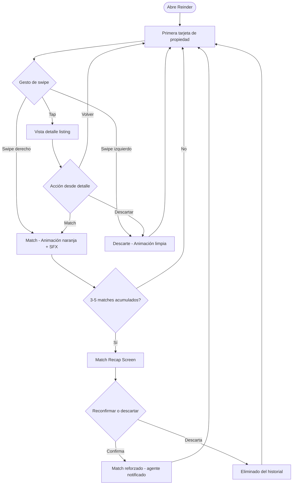
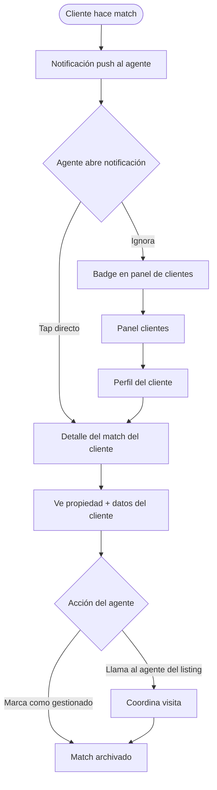
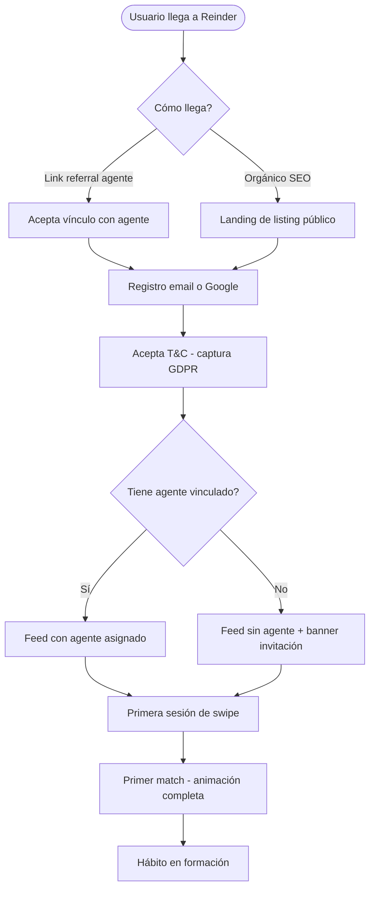

# UX Design Specification — Reinder

**Author:** SantiCas
**Date:** 2026-03-14

---

## Executive Summary

### Project Vision

Reinder no es una app de búsqueda inmobiliaria — es una app de **descubrimiento habitual**. La diferencia es fundamental para el diseño: no se diseña para sesiones largas de filtrado, sino para micro-sesiones de 3-5 minutos que el usuario repite varias veces al día. La UI debe funcionar como una red social, no como un buscador.

La experiencia central es el swipe: el comprador indica interés o descarte sobre propiedades en pantalla completa, una a una, sin fricción. El match es unilateral (la propiedad está disponible, al comprador le gusta) y se entrega en tiempo real al agente representante del comprador — que puede actuar de inmediato.

### Target Users

| Usuario | Contexto de uso | Necesidad UX principal |
|---|---|---|
| **Comprador** | Móvil, momentos muertos (metro, café, cama) | Fricción cero para swipear; feedback satisfactorio en cada acción |
| **Agente representante** | Móvil + escritorio, agenda profesional | Visibilidad rápida de matches; notificaciones accionables |
| **Agencia / Director** | Escritorio, contexto de trabajo | Dashboard de analytics claro; gestión de inventario sin fricción |
| **Admin Reinder** | Escritorio | Panel de control operativo |

### Key Design Challenges

1. **El swipe debe ser adictivo por diseño** — animaciones, SFX, feedback háptico. Si el swipe se siente "plano", el hábito no se forma. Es la interacción más crítica del producto.
2. **Onboarding de doble vínculo** — el comprador necesita entender el modelo de agente representante sin sentirse "vendido". La presentación del referral debe sentirse como un beneficio, no como una venta.
3. **Dos productos en uno** — la experiencia del comprador (swipe móvil) y el panel del agente (dashboard) son paradigmas distintos que deben ser coherentes en identidad pero diferentes en patrón de uso.

### Design Opportunities

1. **El badge "VENDIDA" como mecánica emocional** — puede diseñarse para generar urgencia genuina. El timing y presentación visual son clave.
2. **Gated content SEO** — la landing de un listing (vista pública pre-login) es una superficie de conversión de alta calidad. Gran oportunidad de diseño para captar compradores orgánicos.
3. **Notificación al agente como momento hero** — la notificación de match puede diseñarse para que el agente sienta que tiene información privilegiada en tiempo real.

---

## Core User Experience

### Defining Experience

La experiencia central de Reinder es el **swipe loop** — un ciclo de microconsumo que el comprador repite varias veces al día. No se diseña para una sesión larga sino para múltiples sesiones cortas de 3-5 minutos que se integran en momentos muertos de la vida diaria.

El swipe es el motor, pero hay dos capas adicionales:
- **Recap de matches** — cada 3-5 matcheos, el usuario ve una galería de sus últimas propiedades matcheadas y puede reconfirmar o descartar. No interrumpe el flujo: aparece como pantalla de transición natural entre tandas de swipe.
- **Vista de historial** — el comprador puede salir del swipe en cualquier momento para explorar su lista de matches en detalle.

La búsqueda conversacional (lenguaje natural en lugar de filtros) se reserva para **Phase 2** por complejidad técnica. Para el MVP, el feed actúa como "búsqueda sin palabras".

### Platform Strategy

- **Swipe experience:** App nativa (React Native) — iOS + Android. Es donde vive la experiencia principal del comprador.
- **Panel de agente:** Misma app, login por rol. Acceso a lista de clientes → perfil de cada cliente con actividad reciente (sesiones, tiempo en app) y matcheos.
- **Web (Next.js):** Descubrimiento orgánico (gated content SEO), perfil de usuario, gestión de cuenta. No es el home de la experiencia de swipe.

### Effortless Interactions

- **Swipe:** cero fricción — un gesto, un resultado claro. Sin confirmaciones intermedias.
- **Match recap:** aparece solo, sin que el usuario tenga que buscarlo. La UI lo invita a revisar, no lo fuerza.
- **Notificación del agente:** tap directo desde la notificación al detalle del match del cliente. Cero pasos intermedios.

### Critical Success Moments

1. **Primera sesión de swipe** — el usuario debe sentir placer en el primer swipe. El sonido y la animación del primer match son el gancho.
2. **Primer match recap** — cuando aparece la galería de reconfirmación, el usuario entiende que la app "le está ayudando a decidir", no solo a swipear.
3. **Primera notificación de match al agente** — Elena recibe la notificación, entra, ve el match de su cliente y puede actuar. Si esto ocurre en menos de 1 minuto desde el match, el producto se demuestra solo.

### Experience Principles

1. **Cada acción tiene peso** — ningún swipe, match o notificación se siente trivial. Referencia Balatro: feedback visual + sonoro en cada interacción significativa.
2. **El hábito se diseña, no se espera** — el recap de matches, las sesiones cortas y la ausencia de fricción están al servicio de la repetición diaria.
3. **La app trabaja para el usuario, no al revés** — el agente recibe información sin pedirla; el comprador ve recaps sin buscarlos. La inteligencia es proactiva.
4. **Simplicidad radical en el swipe; riqueza opcional en el detalle** — la pantalla de swipe es limpia; el detalle del listing puede ser completo.

---

## Desired Emotional Response

### Primary Emotional Goals

| Momento | Emoción objetivo |
|---|---|
| Primera sesión de swipe | **Placer + sorpresa** — "esto es diferente a lo que esperaba" |
| Match exitoso | **Gratificación inmediata** — el sonido/animación recompensa el gesto |
| Match recap | **Control + claridad** — "sé exactamente qué me gusta" |
| Historial de matches | **Confianza** — "mi búsqueda está progresando sin esfuerzo" |
| Notificación al agente | **Superioridad informativa** — siente ventaja sobre otros agentes |

### Emotional Journey — Comprador

1. **Descubrimiento** → Curiosidad escéptica ("¿funcionará mejor que Idealista?")
2. **Primer swipe** → Sorpresa positiva ("esto se siente bien")
3. **Primeros matches** → Gratificación + engagement ("quiero más")
4. **Uso recurrente** → Habituación placentera ("abro Reinder sin pensarlo")
5. **Primera visita coordinada** → Validación total ("la app trabajó por mí")

### Micro-Emotions Críticos

- **Gratificación vs. ansiedad:** el swipe recompensa (Balatro-style), no crea presión
- **Confianza vs. escepticismo:** listings exclusivos verificados refuerzan la calidad del inventario
- **Urgencia vs. FOMO artificial:** el badge "VENDIDA" genera urgencia real, no manipulación

### Design Implications

| Emoción | Decisión de diseño |
|---|---|
| Gratificación inmediata | Animación + SFX en cada match; referencia Balatro (payoff visual rico) |
| Control | Match recap cada 3-5 swipes; historial siempre accesible |
| Confianza | Solo exclusivas verificadas; badge "Exclusiva" visible en cada tarjeta |
| Superioridad (agente) | Notificación diseñada como "alerta de inteligencia", no como spam |
| Urgencia genuina | Badge "VENDIDA" con timestamp — contexto, no presión |

### Emotions to Avoid

- ❌ **Ansiedad de FOMO** — sin urgencia artificial
- ❌ **Fatiga de scroll** — recap de matches y sesiones cortas previenen el burnout
- ❌ **Desconfianza** — ningún listing duplicado o de baja calidad llega al feed

---

## UX Pattern Analysis & Inspiration

### Inspiring Products Analysis

**Balatro** *(referencia visual/sonora principal)*
- Cada acción tiene peso: animaciones de payoff que hacen que cada gesto se sienta ganador
- Estética oscura/rica con destellos de color — premium sin ser fría
- Loop de "una ronda más" construido mediante gratificación acumulada, no presión
- **Aplicación a Reinder:** el swipe y el match deben tener este nivel de satisfacción sensorial

**Tinder** *(referencia de mecánica de swipe)*
- Tarjeta full-screen: el contenido es el foco, la UI desaparece
- El "match" como momento celebratorio con feedback distintivo
- **Aplicación a Reinder:** adoptar el patrón de swipe y la tarjeta full-screen. Diferenciar el tono del match — más "encontrado" que "enamorado"

**TikTok** *(referencia de sesión corta y hábito)*
- Feed de sesión corta que se abre sin intención consciente
- La app aprende del comportamiento pasivo del usuario
- **Aplicación a Reinder:** el recap de matches cumple la función de "feed que aprende"; las sesiones cortas son el objetivo, no la limitación

**Duolingo** *(referencia de hábito, Phase 2)*
- El hábito diario gamificado sin gamificar el contenido directamente
- **Aplicación a Reinder (Phase 2):** métricas de engagement tipo "llevas X días buscando" pueden reforzar el hábito

### Transferable UX Patterns

- **Swipe full-screen** con feedback visual/sonoro inmediato (Tinder → Reinder)
- **Recap periódico** de matches como momento de respiro en el loop (patrón nativo de Reinder)
- **Tap en notificación → acceso directo** al item relevante, cero pasos intermedios (TikTok)
- **Hero image + datos esenciales superpuestos** en la tarjeta de propiedad
- **Paleta oscura/rica** con acentos de color y micro-animaciones (Balatro)
- **Badge de estado** (VENDIDA, EXCLUSIVA) visible en tarjeta sin interrumpir la foto

### Anti-Patterns to Avoid

- ❌ **Feed con filtros como primera pantalla** (Idealista): crea fricción antes de dar valor
- ❌ **Notificaciones de spam sin contexto** — la notificación del agente debe ser accionable
- ❌ **Match con acción requerida de ambas partes** — en Reinder el match es unilateral, no crear la expectativa equivocada
- ❌ **Pop-ups en medio del session flow** — cero interrupciones salvo el recap planificado

### Design Inspiration Strategy

- **Adoptar directamente:** swipe full-screen (Tinder), payoff visual/sonoro (Balatro), acceso directo desde notificación (TikTok)
- **Adaptar:** el "match moment" → tono sofisticado, más "encontrado" que "enamorado"
- **Inventar:** el match recap cada 3-5 swipes — patrón nativo de Reinder sin precedente directo en referencias

---

## Design System Foundation

### Design System Choice

**Custom Design System sobre tokens propios** — no se usa un sistema pre-existente (Material, Ant Design) como base visual. Reinder necesita control completo sobre animaciones, paleta y tipografía para lograr la estética Balatro-inspired con naranja como color predominante.

**Implementación práctica:**
- **Web (Next.js):** componentes React custom + CSS variables para tokens de diseño
- **Mobile (React Native):** Reanimated 3 para animaciones fluidas a 60fps + StyleSheet nativo
- **Tokens compartidos** entre web y mobile (colores, espaciados, tipografía) en `design-tokens.json`

### Paleta de Color

| Token | Valor | Uso |
|---|---|---|
| `--bg-primary` | `#0D0D0D` – `#1A1208` | Fondo oscuro con tinte cálido (no frío) |
| `--accent-primary` | `#FF6B00` – `#FF8C00` | **Naranja — color predominante de marca** |
| `--accent-match` | `#FF6B00` | Payoff visual del match |
| `--accent-reject` | `#8B3A3A` | Rojo apagado, no agresivo |
| `--text-primary` | `#F5F0E8` | Blanco crema — más cálido que blanco puro |
| `--surface` | `#1E1A15` | Tarjetas y paneles — oscuro con tinte cálido |

La gama cálida (naranja + crema + gris oscuro cálido) crea coherencia total — no mezcla temperaturas de color. El naranja en el momento de match refuerza la gratificación psicológica de la acción.

### Rationale

1. **Identidad visual única:** la estética oscura + naranja no encaja en los defaults de sistemas establecidos. Un sistema custom es la única forma de conseguirlo sin pelear contra el framework.
2. **Animaciones de alto nivel:** Reanimated 3 garantiza 60fps en el swipe — requisito crítico.
3. **Construcción incremental:** el design system se construye empezando sólo por los componentes del swipe y se extiende en fases posteriores.

### Build Strategy

- **MVP:** tokens de color + tipografía + componentes de swipe (tarjeta, botones de acción, animación de match, tab bar)
- **Phase 2:** extender a panel de agente, landing SEO, componentes de analytics

---

## Defining Core Experience

### La Experiencia Definidora

> **"Swipe para descubrir tu próxima casa — sin esfuerzo, cuando quieras."**

Si Reinder hace una cosa perfectamente, es que la búsqueda inmobiliaria se convierte en un gesto natural que el comprador hace sin pensar, varias veces al día, y que trabaja por él mientras lo hace.

### User Mental Model

Los compradores llegan con el modelo mental de Idealista: buscar = filtros + 200 resultados + agotamiento. Reinder reemplaza ese modelo:

- **Antes:** "Busco casa" → sesión de 45 minutos de esfuerzo
- **Con Reinder:** "Swipeo en el metro" → la app acumula preferencias y el agente actúa

El reto de diseño: el usuario entiende este nuevo paradigma en la primera sesión, sin explicación explícita.

### Experience Mechanics — El Swipe Loop

**1. Iniciación** — apertura directa a la primera tarjeta. Cero pantallas intermedias.

**2. Interacción**
- Swipe derecho → match (naranja brillante, SFX de "found it")
- Swipe izquierdo → descarte (animación limpia, sin SFX negativo)
- Tap en tarjeta → detalle completo del listing

**3. Feedback — Payoff Balatro-style**
- Match: animación naranja expansiva + sonido breve y convincente
- Descarte: deslizamiento limpio a la siguiente propiedad
- Recap cada 3-5 matches: galería mini para reconfirmar o descartar — refuerza control sin interrumpir

**4. Fin de sesión** — el usuario sale cuando quiere. Al reabrir: badge de "X nuevas propiedades desde tu última visita"

### Novel vs. Established Patterns

| Elemento | Tipo |
|---|---|
| Swipe para match/descarte | Establecido (Tinder) — cero educación necesaria |
| Tarjeta full-screen | Establecido (Tinder/Airbnb) |
| Match recap periódico | **Nativo de Reinder** — mínima educación |
| Notificación unilateral al agente | **Nativo de Reinder** |

### Success Criteria de la Experiencia Core

- ✅ El usuario hace su primer match en los primeros 30 segundos de primera sesión
- ✅ El usuario vuelve a la app sin notificación externa (hábito orgánico)
- ✅ El recap de matches no genera confusión — el usuario entiende su función sin texto de ayuda

---

## Visual Design Foundation

### Color System

| Token | Valor | Semántica |
|---|---|---|
| `--bg-primary` | `#0D0D0D` | Fondo base app |
| `--bg-surface` | `#1E1A15` | Tarjetas, modales |
| `--accent-primary` | `#FF6B00` | Brand / CTA / match payoff |
| `--accent-warm` | `#FF8C00` | Hover states, highlights |
| `--accent-reject` | `#8B3A3A` | Descarte |
| `--accent-sold` | `#6B4E00` | Badge "VENDIDA" — ámbar oscuro |
| `--text-primary` | `#F5F0E8` | Texto principal |
| `--text-muted` | `#9E9080` | Texto secundario, metadatos |
| `--border` | `#2E2820` | Líneas divisoras |

Contraste: `#FF6B00` sobre `#0D0D0D` = ratio 5.4:1 ✅ (supera WCAG AA para texto grande)

### Typography System

- **Display / Logo:** Clash Display — geométrica, moderna, diferente a los sans-serif genéricos de portales inmobiliarios
- **UI / Cuerpo:** Inter — máxima legibilidad en pantallas, estándar de facto para apps modernas

| Nivel | Tamaño | Uso |
|---|---|---|
| `display` | 32px / 700 | Precio en tarjeta de propiedad |
| `h1` | 24px / 600 | Títulos de sección |
| `h2` | 20px / 600 | Nombre de propiedad |
| `body` | 16px / 400 | Descripción, texto corrido |
| `small` | 13px / 400 | Metadatos, badges |

### Spacing & Layout Foundation

- **Base unit:** 8px. Todos los espaciados son múltiplos de 8
- **Swipe:** full-screen, sin margins laterales — la tarjeta ocupa todo el viewport
- **Detalle:** padding 16px horizontal, secciones separadas por 24px
- **Tab bar:** 60px de alto, naranja en estado activo

### Accessibility

- Contraste naranja/#0D0D0D: 5.4:1 ✅
- Swipe + botones visuales como alternativa táctil
- Alt text en todas las imágenes de listing

---

## Design Direction Decision

### Chosen Direction: Direction 3 — Glassmorphism

Capas traslúcidas sobre fondo oscuro con naranja como único color de energía. Glow effects sutiles. Premium sin agresividad. La dirección más diferenciada del mercado inmobiliario.

### Rationale

- **Sofisticación premium:** comunica que Reinder es un producto de calidad superior sin necesidad de elementos recargados
- **Naranja como foco de atención:** con todo lo demás en dark/glass, el naranja se convierte en el único elemento de alta energía — el match, el CTA, el logo
- **Profundidad visual:** el backdrop-filter crea capas que sugieren riqueza sin saturar
- **Diferenciación total:** ningún portal inmobiliario tiene este tratamiento visual

### Implementation Notes

- Usar `backdrop-filter: blur(20px)` en tarjetas y modales — verificar performance en Android mid-range
- Fallback para dispositivos sin soporte: `background: rgba(30,26,21,0.95)` 
- Glow effects con `box-shadow` naranja en botones de match y elementos de estado activo
- Gradiente de fondo: radial desde `rgba(255,107,0,0.12)` hacia negro — da calor sin saturar

---

## User Journey Flows

### Journey 1: Comprador — Swipe Loop + Recap



### Journey 2: Agente — Notificación → Acción



### Journey 3: Onboarding — Primer acceso



### Journey Patterns Comunes

| Patrón | Descripción |
|---|---|
| **Tap → contexto directo** | Desde notificación o badge, un tap lleva al item sin pasos intermedios |
| **Match → feedback → continuidad** | El match se celebra brevemente y el swipe continúa sin fricción |
| **Error = sin bloqueo** | Si algo falla, el usuario continúa con los demás listings |

---

## Component Strategy

### Core Components — Phase 1 (MVP)

| Componente | Descripción | Estados |
|---|---|---|
| **PropertyCard** | Tarjeta full-screen glassmorphism | Default, loading, sold |
| **SwipeActions** | Botones reject/info/match con glow naranja | Default, pressed, animating |
| **MatchPayoff** | Overlay de celebración de match | Appear, celebrating, dismiss |
| **MatchRecapScreen** | Galería de últimos 3-5 matches para reconfirmar | Loading, populated, empty |
| **TabBar** | Navegación inferior rol-based | Default, active (naranja) |
| **PropertyBadge** | Chips EXCLUSIVA / VENDIDA / NUEVA | Each variant |
| **AgentClientCard** | Tarjeta de cliente en panel del agente | Default, has-new-matches |
| **GlassPanel** | Base reutilizable glassmorphism | Light, medium, heavy blur |

### Supporting Components — Phase 2

| Componente | Descripción |
|---|---|
| **MatchHistoryList** | Lista completa de matches con filtros |
| **PropertyDetailView** | Vista expandida con galería |
| **AgentReferralBanner** | Banner de invitación a vincular agente |

### File Structure

```
design-tokens.json
└── components/
    ├── PropertyCard/
    ├── SwipeActions/
    ├── MatchPayoff/
    ├── MatchRecapScreen/
    ├── TabBar/
    └── shared/
        ├── Badge/
        └── GlassPanel/
```

### Accessibility

- **PropertyCard:** alt text imagen + label ARIA con precio y ubicación
- **SwipeActions:** labels ARIA "Me interesa" / "No me interesa" + soporte teclado
- **TabBar:** roles de navegación ARIA correctos

---

## UX Consistency Patterns

### Button Hierarchy

| Nivel | Apariencia | Uso |
|---|---|---|
| **Primary** | Naranja sólido + glow sutil | Acción más importante (Match, Continuar) |
| **Secondary** | Glass + borde naranja translúcido | Acciones secundarias (Ver detalle, Volver) |
| **Destructive** | Glass + borde rojo apagado | Descarte, eliminar match |
| **Ghost** | Solo texto naranja | Acciones terciarias (Omitir, Más tarde) |

### Feedback Patterns

| Situación | Tratamiento |
|---|---|
| **Match exitoso** | Overlay naranja expansivo + SFX → auto-cierre en 1.5s |
| **Descarte** | Animación de deslizamiento → siguiente tarjeta inmediata |
| **Error de red** | Toast glass en borde inferior: "Sin conexión — guardando para cuando vuelvas" |
| **Listing expirado** | Badge "VENDIDA" + skip automático al siguiente |
| **Feed vacío** | Empty state + CTA de ajuste de zona |

### Navigation Patterns

- **Tab bar:** 3 tabs comprador (Swipe / Matches / Perfil), 2 tabs agente (Clientes / Notificaciones)
- **Back:** gesto de swipe desde el borde izquierdo — nunca botón explícito en el feed
- **Modal detail:** la vista de detalle se abre como sheet bottom-up, no como nueva pantalla
- **Deep link:** cualquier notificación abre directamente el item relevante, cero pantallas intermedias

### Loading & Empty States

- **Loading card:** skeleton glassmorphism pulsante con naranja sutil en bordes
- **Sin matches aún:** texto simple "Swipea para empezar a matchear"
- **Feed agotado:** "Has visto todas las propiedades de hoy — vuelve mañana" + badge de nuevas esperadas

### Animation Tokens

- `--duration-fast: 150ms` — hover, focus
- `--duration-normal: 300ms` — transiciones de página
- `--duration-payoff: 600ms` — animación de match
- `--ease-spring: cubic-bezier(0.34, 1.56, 0.64, 1)` — payoff del match
- `--radius-card: 24px` · `--radius-btn: 12px` · `--radius-pill: 999px`

---

## Responsive Design & Accessibility

### Responsive Strategy

**Mobile-first** — la app nativa es el canal principal. La web sirve para SEO/discovery.

| Plataforma | Estrategia |
|---|---|
| **iOS/Android (React Native)** | Experiencia nativa. Swipe full-screen, gestos nativos, notificaciones push. |
| **Web Mobile (Next.js)** | Listings públicos para SEO. CTA de descarga de app. No swipe. |
| **Web Desktop** | Panel de agente + landing de marketing. Layouts multi-columna. |
| **Tablet** | RN: misma experiencia que móvil con cards más grandes. Web: 2 columnas. |

### Breakpoints Web

| Breakpoint | Rango | Layout |
|---|---|---|
| `mobile` | < 768px | 1 columna, tab bar inferior |
| `tablet` | 768–1023px | 2 columnas, sidebar colapsable |
| `desktop` | ≥ 1024px | 3 columnas, sidebar fijo (panel agente) |

### Accessibility Strategy — WCAG AA

- Contraste mínimo 4.5:1 texto normal — naranja/#0D0D0D = 5.4:1 ✅
- Touch targets mínimo 44×44px — botones de swipe: 54×54px ✅
- Badges con texto + color (no solo color)
- Respetar `prefers-reduced-motion` — desactivar SFX y animaciones si el usuario lo configura

### Testing Strategy

- Responsive: Chrome DevTools + dispositivos reales (iPhone SE, Galaxy A series mid-range)
- Accessibility: `axe` automated scan en cada PR + VoiceOver (iOS) en el swipe flow
- Keyboard: navegación teclado para la versión web (panel agente)

### Implementation Guidelines

```css
/* Unidades relativas */
font-size: 1rem;
padding: 1rem 1.5rem;
min-height: 44px; /* touch target mínimo */

/* Mobile-first */
@media (min-width: 768px) { ... }
@media (min-width: 1024px) { ... }

/* Reduced motion */
@media (prefers-reduced-motion: reduce) {
  .match-payoff { animation: none; }
}
```
